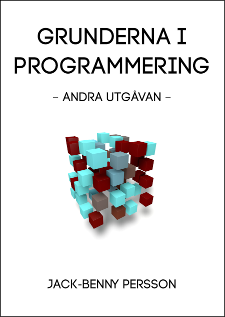

# Grunderna i programmering
Här finner du all exempelkod för *Grunderna i programmering (andra utgåvan)*
(ISBN: 978-91-983300-5-2).

Boken går att köpa från [CyberInfo Sverige](https://www.cyberinfo.se/bocker/),
[Bokus](https://www.bokus.com/bok/9789198330052/grunderna-i-programmering/) och
[Adlibris](https://www.adlibris.com/se/bok/grunderna-i-programmering-9789198330052).

Är du nyfiken på boken så titta gärna i [innehållsförteckningen](https://www.cyberinfo.se/dokument/gip_innehallsforteckning_2a_utg.html).

## Errata
Trots flera korrekturläsningar och testkörningar av koden har två fel kommit
med i boken.

* Kodexemplet på sidan 103 saknar kolon och parenteser. Rätt 
kod [finns här](sidan_103_ex1.py).
* Det första kodexemplet på sidan 104 har ett felaktigt variabelnamn. Rätt 
kod [finns här](sidan_104_ex1.py).

## Baksidetexten
**Grunderna i programmering** lär ut de grunder du behöver för att komma igång
med programmering i Python och Scratch. Boken börjar med en kort genomgång av
Scratch, och visar med några exempel på hur Scratch kan vara användbart för att
förstå grundläggande koncept i programmering. I denna introduktion får vi också
se hur Pythonkod och Scratchkod faktiskt liknar varandra.

Därefter går vi vidare med att utforska Python, vilket också är huvudinnehållet
i boken. Men innan vi kastar oss in i programmeringens värld får vi en
genomgång av hur datorn är uppbyggd, och var i datorn saker som kod, variabler,
program med mera sparas. Vi får också se hur allting i datorn hänger samman.
När vi väl har denna förståelse är det dags för programmeringen. Vi börjar med
datatyper och går sedan vidare med if-satser, loopar, standardbiblioteket och
allt som vi behöver kunna för att börja programmera. Allting avslutas med ett
större projekt.

Boken var från början tänkt som studiematerial till kurser i programmering men
går utmärkt att använda på egen hand för självstudier. Bokens grundtanke är att
lära ut programmering som helhet även om Python används i bokens huvuddel.

Denna utgåvan har uppdaterats för Scratch 3.0 och Python 3.8. En lång rad andra
uppdateringar och förbättringar har också gjorts.

## Framsidan

